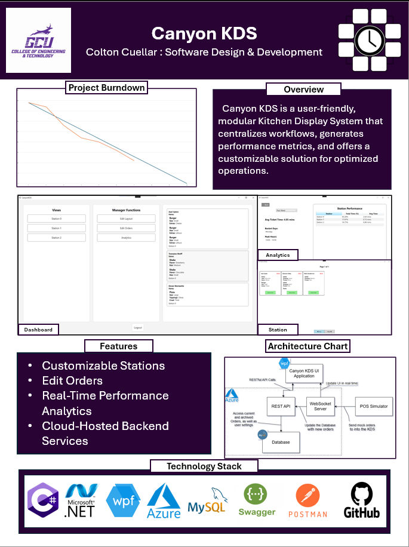
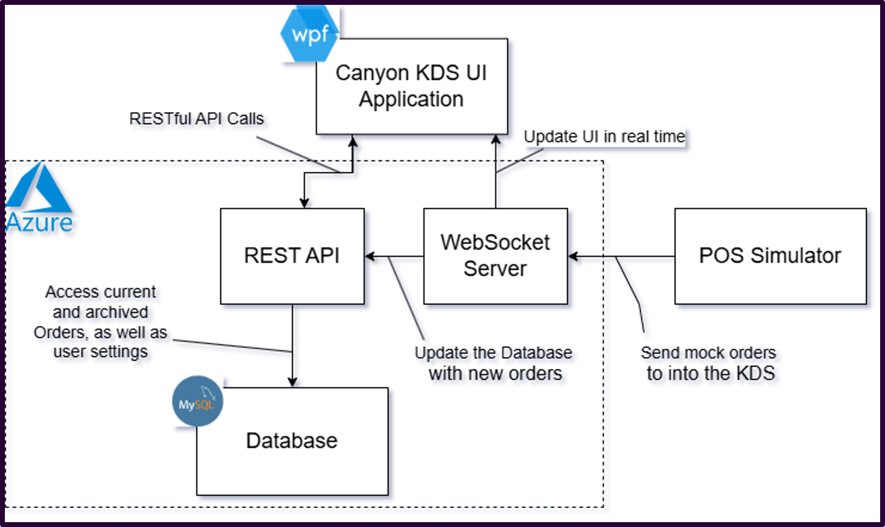
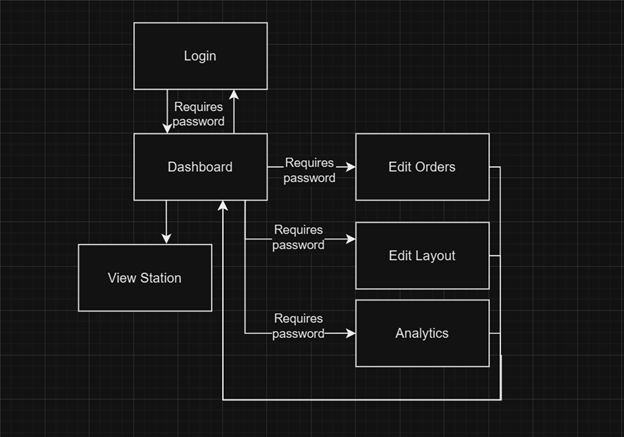
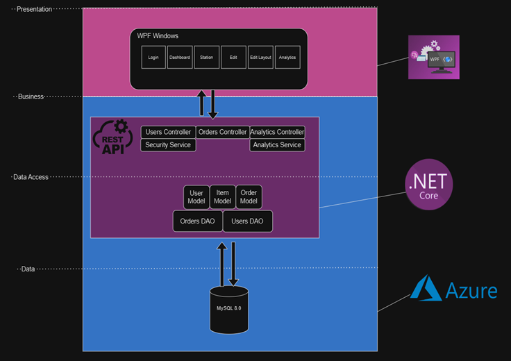

# 🎓 Capstone Portfolio: Canyon KDS

Welcome to my Software Development Capstone Project portfolio. This page provides a professional overview of my final project, **Canyon KDS** — a real-time Kitchen Display System designed to improve restaurant workflow management.

---

### Showcase Poster

## 📌 Project Overview

**Problem:**  
Many small to mid-sized restaurants lack affordable, modular systems to efficiently manage kitchen order workflows. My goal was to create a solution that brings **real-time, multi-station order visibility** with performance tracking, in a lightweight and affordable manner.

**Solution:**  
Canyon KDS is a cloud-enabled, modular Kitchen Display System using a REST API + WebSockets for real-time communication. It supports order routing across multiple kitchen stations, analytics, and dynamic kitchen layout customization, with an adaptable data format intended to suit many different kinds of kitchens and businesses.

---

## ✅ Project Requirements

### Functional Requirements
🔐 Login & Authentication

Users can enter a username and password to log in securely.

The system provides a non-descriptive error message if login fails.

Successful login redirects users to the main dashboard.

🖥️ Dashboard Navigation

Users land on a dashboard that grants access to all key features.

Users can open multiple station views in separate windows.

Buttons are provided to access Layout Editor, Order Editor, and Analytics.

📋 Station View Management

Station views can be opened on separate screens for multitasking.

Orders can be bumped to the next station in the sequence.

An UNDO button is available to reverse bumps.

Users can bump individual items from orders.

Each station view displays a live list of relevant orders.

✏️ Edit Orders

Users can view a list of all current orders in the system.

Orders are editable; item names, quantities, and notes can be changed.

Users can navigate back to the dashboard after editing.

🧩 Layout Management

Users must enter a password to access layout editing (manager-only feature).

Stations can be added, named, and removed to fit the kitchen workflow.

The layout reflects the actual workflow in a customizable way.

📊 Analytics

An analytics dashboard shows kitchen performance data.

Users can sort analytics by timeframe (e.g., daily, weekly).

Average ticket time is displayed both overall and per station.

Performance data is pulled from an archive of completed orders.

### Non-Functional Requirements
🔒 Security

User passwords are hashed before storage, protecting credentials.

Only users with the manager password can access system settings (e.g., layout editor).

⚡ Performance

The system aims for 99.9% uptime on the database server to ensure reliability.

The database must respond to requests within 1 second under normal usage.

System actions (e.g., bumping orders, opening windows) respond in under 500ms.

🧠 Usability

The station screen UI is intuitive and can be learned quickly by new staff.

Users are guided through login, order management, and analytics with minimal training.

🧱 Maintainability & Scalability

The architecture is modular, with UI, API, and WebSocket layers separated into distinct repositories.

Station configurations and analytics filters are designed to allow future expansion or adaptation.

---

## 🧰 Technology Stack

| Layer | Technologies Used |
|-------|-------------------|
| Frontend (Desktop UI) | WPF (C#), MVVM |
| Backend | ASP.NET Core API |
| Real-Time | WebSockets |
| Database | MySQL |
| Deployment | Azure App Services, Azure Flexible MySQLDatabase|
| Other Tools | GitHub, Postman, Swagger, Jira, Burndown Charts |

**Why these?**  
These reflect industry-standard tools for cross-platform C# development, real-time messaging, cloud hosting, and RESTful APIs. I applied best practices in MVVM design, authentication, and modular system structure.

---

## ☁️ DevOps and Deployment

- **Source control:** GitHub with submodules for UI/API separation  
- **CI/CD concepts:** Manual testing and staged commits  
- **Hosting:** Deployed on Azure using App Services (API) + ClearDB (MySQL)  
- **Monitoring:** Debug and console logging for API and WebSocket layers

---

## 📚 New Technologies Learned

- **WebSockets:** To enable real-time UI updates across multiple windows  
- **JWT Authentication:** For secure login and session control  
- **Azure Deployment:** For real-world cloud hosting experience
- **WPF** For Desktop application development
---

## 🧠 Technical Architecture

  
*A hybrid system with REST + WebSocket communication, and a MySQL database on Azure.*

---

## 🔍 Design Details

### Sitemap Diagram

### Logical Solution Design

---

## ⚠️ Risks and Challenges

| Challenge | Solution |
|----------|----------|
| WebSocket filtering by user | Refactored server-side routing with `userId` support |
| UI desync across station windows | Introduced real-time MVVM bindings and dispatcher calls |
| Azure MySQL connectivity issues | Adjusted connection string + SSL configuration |
| Orders table primary key duplication error | Rewrote order generation to utilize longer, unique ID's based on time + ticks |

**Risk Management:**  
I used version control, regular backups, and researched extensively (StackOverflow, Microsoft Docs, OpenAI) when solving bugs or unclear errors.

---

## 📝 Outstanding Issues

- Real-time bumping of individual **order items** (currently bumps entire order)  

---

## 💼 Use This Portfolio in Interviews

- 🔗 [Canyon KDS UI Repository](https://github.com/Colton82/KDSUI)
- 🔗 [Canyon KDS API Repository](https://github.com/Coton82/KDSAPI)
- 🔗 [POS Simulator Tool](https://github.com/Colton82/FakePOS)
- 🔗 [All-In-One Repo with downloadable ZIP](https://github.com/Colton82/CapstoneFinal)

---

## 🙋 About Me

**Colton Cuellar**  
- 📅 Expected Graduation: April 2025, Grand Canyon University  
- 📧 coltoncuellar82@gmail.com
- 🌐 [LinkedIn](https://www.linkedin.com/in/colton-cuellar-10189b252/)

---

